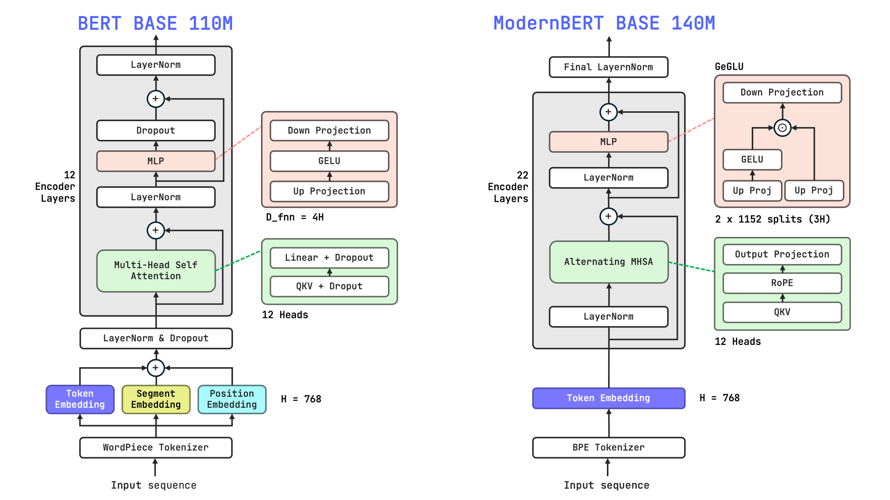
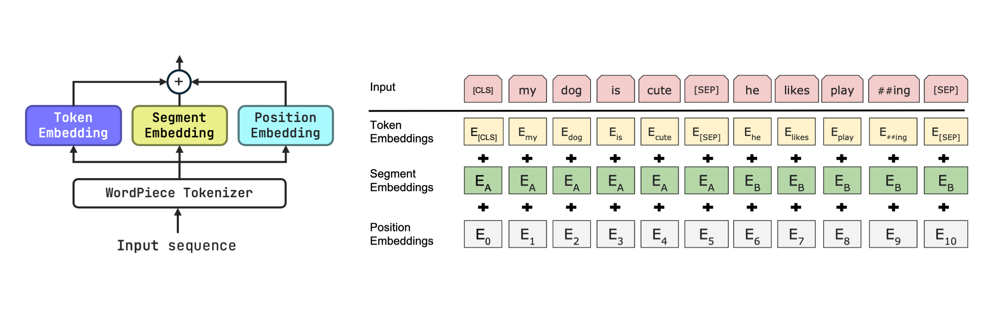
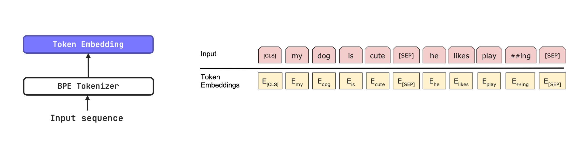
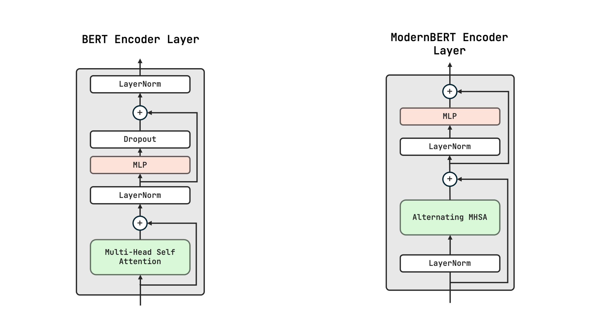
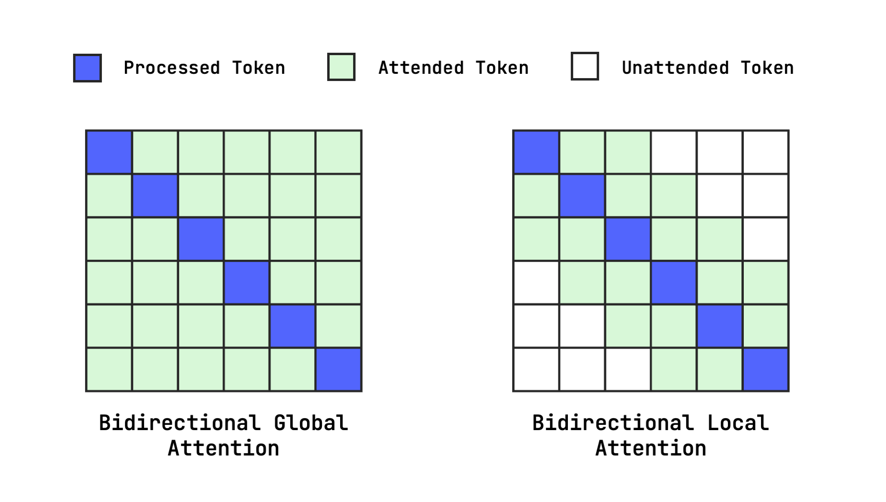
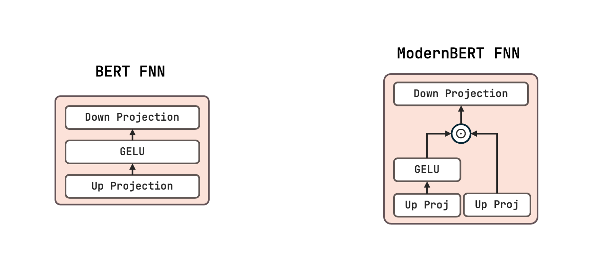
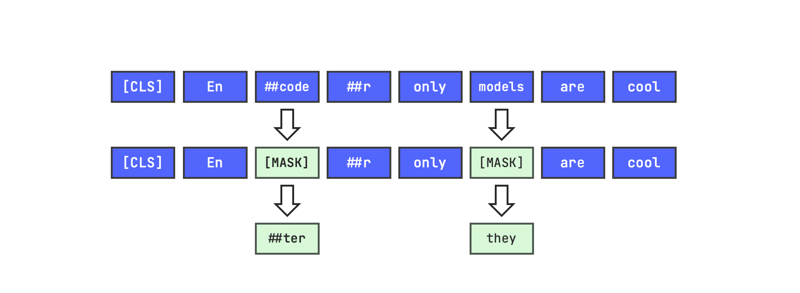
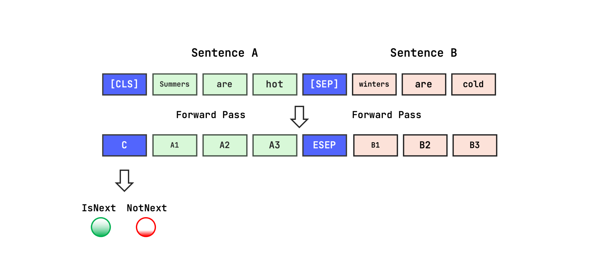
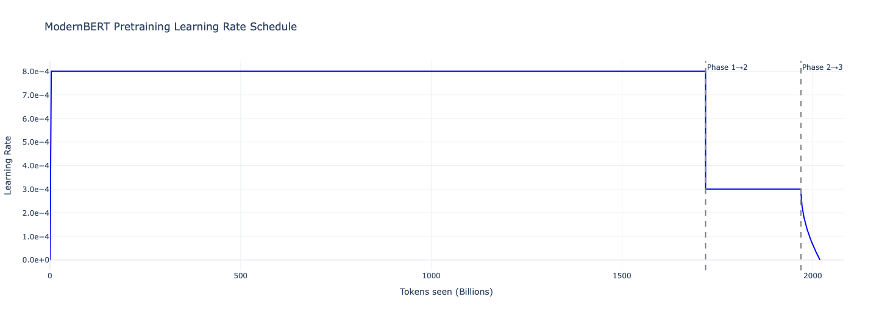

In my blog post ["Code-Aware Tokenization: ModernBERT"](https://www.mohammedsbaihi.com/blogs/modernbert.html) I have explored the code awareness in tokenization techniques used in ModernBERT comparted to the traditional BERT tokenizer. Where we confirmed the authors claims about the superiority of ModernBERT in handling code snippets effectively, at least in terms of tokenization.

But tokenization isn't the only aspect where ModernBERT evolves from BERT. ModernBERT came out in December 2024, almost 7 years after BERT's release in 2018. In this time, the field of NLP has seen significant advancements, especially with the rise of decoder-only models like GPT. Therefore in this post, we will compare ModernBERT and BERT across several dimensions including architecture, training paradigms and training data among others. Note that we will focus on the BASE versions of both models, but we'll highlight differences in LARGE versions where relevant.

<p align="center">
    
</p>

Figure 1: Architectures of the BASE version of BERT and ModernBERT

<div class="toc">

## Table of Contents
1. [Architecture](#1-architecture)
   - [Embedding Layer](#11-embedding-layer)
   - [Encoder Layers](#12-encoder-layers)
     - [Attention Mechanism](#121-attention-mechanism)
     - [MLP](#122-mlp)
     - [Normalization](#123-normalization)
     - [Dropout](#124-dropout)
2. [Training Objectives](#2-training-objectives)
   - [Masked Language Modeling (MLM)](#21-masked-language-modeling-mlm)
     - [MLM in BERT](#211-mlm-in-bert)
     - [MLM in ModernBERT](#212-mlm-in-modernbert)
   - [Next Sentence Prediction (NSP)](#22-next-sentence-prediction-nsp)
3. [Training Data](#3-training-data)
   - [BERT Training Data](#31-bert-training-data)
   - [ModernBERT Training Data](#32-modernbert-training-data)
4. [Training Paradigms](#4-training-paradigms)
   - [BERT Training Paradigm](#41-bert-training-paradigm)
   - [ModernBERT Training Paradigm](#42-modernbert-training-paradigm)
5. [Conclusion](#5-conclusion)

</div>

## 1. Architecture
Both BERT and ModernBERT are based on the [Transformer architecture](https://arxiv.org/abs/1706.03762). They both utilize the encoder part of the Transformer, which is designed for Representation Learning (i.e., the goal is to learn rich representations of the input text) as opposed to decoder architectures used in models like GPT, which are optimized for text generation. However, ModernBERT incorporates several architectural improvements over BERT. These improvements are especially inspired by advancements in decoder models. We'll go over them in this section.

### 1.1 Embedding Layer
To represent input embeddings, BERT uses a combination of token embeddings, segment embeddings and position embeddings.
These embeddings are summed together and are learned during training. Token embeddings are the base embeddings for each token in the vocabulary. Segment embeddings are used to differentiate between two sentences in the Next Sentence Prediction (NSP) task, which was one of the two pre-training objectives of BERT (alongside Masked Language Modeling (MLM)). Position embeddings are used to inject positional information into the model since during training (and inference as well in encoder models) tokens are processed in parallel and thus the model has no inherent sense of token order. 

<p align="center">
    
</p>

Figure 2: BERT's Embedding Layer

Note that while the original BERT paper doesn't state whether they use learned (absolute) position embeddings or sinusoidal position encodings as in the original Transformer paper, but we can confirm that they use learned position embeddings by inspecting the BERT implementation in the HuggingFace `transformers` library.

```python
from transformers import BertModel
bert = BertModel.from_pretrained("bert-base-cased")
print(f"Type of Position Embedding:  {bert.config.position_embedding_type}")
print(f"Maximum Position:  {bert.config.max_position_embeddings}")
```

```bash
Type of Position Embedding:  absolute
Maximum Position:  512
```

We see that BERT uses absolute learned position embeddings with a maximum sequence length of 512 tokens. Which is the reason why BERT has a maximum input length of 512 tokens. This limit is especially hard capped by the architecture.

ModernBERT, on the other hand, only uses learned token embeddings, it doesn't use segment embeddings since it doesn't use the NSP objective during pre-training (we'll discuss this more in the Training Objectives section). And it doesn't use position embeddings either. Instead it uses [Rotary Position Embeddings (RoPE)](https://arxiv.org/abs/2104.09864) to inject positional information into the model. RoPE has been shown to be more effective than absolute position embeddings in capturing relative positions between tokens, which is crucial for understanding context in language. Additionally, RoPE allows ModernBERT to handle longer sequences more effectively than BERT, as it doesn't have a hard cap on input length like BERT does. While it still has a limit of 8192 tokens, this limit is soft and not architecturally enforced. This limit is especially achieved by tuning RoPE scaling parameters during training. Nevertheless, you can go beyone this limit during inference but with potential degradation in performance.

<p align="center">
    
</p>

Figure 3: ModernBERT's Embedding Layer

One common aspect here is that both models have a hidden dimension of 768 in their BASE versions and 1024 in their LARGE versions.

### 1.2 Encoder Layers
Both BERT and ModernBERT use the Transformer encoder layers. Each layer consists of the following building blocks (not in order):
- Self-Attention Mechanism
- MLP (Feed-Forward Neural Network)
- Normalization
- Residual Connections

<p align="center">
    
</p>

Figure 4: Encoder Layers in BERT and ModernBERT

But each model has its own tweaks to these building blocks. And we will discuss each one below. But one main difference is that BERT has 12 encoder layers in its BASE version and 24 in its LARGE version, while ModernBERT has 22 encoder layers in its BASE version and 28 in its LARGE version. Which also explain the difference in the number of parameters: 

| Model        | BASE  | LARGE  |
|--------------|-------|--------|
| BERT         | 110M  | 340M   |
| ModernBERT   | 149M  | 395M   |


#### 1.2.1 Attention Mechanism
BERT uses the standard Bidirectional Multi-Head Self-Attention mechanism with the traditional scaled dot-product attention (SDPA) formula as described in the original Transformer paper. I do not intend to go into the details of how self-attention works here, but you can refer to the [Illustrated Transformer](http://jalammar.github.io/illustrated-transformer/) blog post for a detailed explanation.

ModernBERT also uses the same mechanism but with three main differences:
1. **Alternating Attention**:
    ModernBERT alternates between Global (Full) Attention and Local Attention. Global Attention is used every 3rd layer. See Figure below for a visual representation of these attention patterns.

    This means that in layers where Local Attention is used, each token can only attend to a fixed window $w$ of neighboring tokens ($w=128$ in BASE version). This significantly reduces the computational complexity of the attention mechanism from $O(L^2)$ in every layer in BERT to $O(L \cdot w)$ in Local Attention layers in ModernBERT, where $L$ is the sequence length. While the Global Attention layers still have a complexity of $O(L^2)$, They only make up 1/3 of the total layers, thus reducing the overall complexity of the model.

<p align="center">
    
</p>

Figure 5: Global and Local Attention Patterns in Bidirectional MLM

2. **RoPE**:
    As I mentioned earlier, ModernBERT uses RoPE to inject positional information into the model. This happens in every attention layer by modifiying the query and key vectors before computing the attention scores.

    i.e $Q \leftarrow RoPE(Q)$ and $K \leftarrow RoPE(K)$

    You can refer to the [Rotary Position Embeddings paper](https://arxiv.org/abs/2104.09864) for more details on how RoPE works.

    The authors also affirm that they use different RoPE scaling factors:
    - Local layers: $\theta ≈ 10,000$
    - Global layers: $\theta ≈ 10,000$ for the first 1.7T tokens at a 1024 sequence length, then $\theta ≈ 160,000$ for the remaining 300B tokens to extend the effective context length to 8,192 tokens.


3. **Flash Attention**:
    ModernBERT uses a mixture of Flash Attention 3 for Global layers and Flash Attention 2 for Local layers. [FlashAttention](https://arxiv.org/abs/2205.14135) is a memory-efficient implementation of self-attention that avoids materializing the full $Q K^T$ attention matrix in GPU memory. Instead, it computes attention in tiled blocks, streaming data through fast on-chip SRAM, which drastically reduces memory access and speeds up training and inference while enabling much longer context lengths.

However, both models use the same number of attention heads: 12 in BASE versions and 16 in LARGE versions.

#### 1.2.2 MLP

<p align="center">
    
</p>

Figure 6: Feed Forward Network Layers in BERT and ModernBERT

BERT uses a standard two layer Feed-Forward Neural Network (FFN) with a GELU activation function in between. The hidden dimension of the FFN is 4 times the model's hidden dimension (i.e 4x expansion). 

```bash
(intermediate): BertIntermediate(
  (dense): Linear(768 → 3072)
  (intermediate_act_fn): GELU
)

(output): BertOutput(
  (dense): Linear(3072 → 768)
  (LayerNorm)
  (dropout p=0.1)
)
```
Parameter count:
- first layer: 768×3072 + 3072 (bias)= 2,359,296 + 3,072 = 2,362,368
- second layer: 3072×768 + 768 (bias)= 2,359,296 + 768 = 2,360,064
- Total: 4,72M parameters per encoder block.

ModernBERT, on the other hand, uses a modern gated MLP architecture.
````python
from transformers import ModernBertModel
modernbert = ModernBertModel.from_pretrained("answerdotai/ModernBERT-base")
modernbert.base_model.layers[0].mlp
````

```bash
ModernBertMLP(
  (Wi): Linear(in_features=768, out_features=2304, bias=False)
  (act): GELUActivation()
  (drop): Dropout(p=0.0, inplace=False)
  (Wo): Linear(in_features=1152, out_features=768, bias=False)
)
```

At first glance, the dimension might seem confusing, since the first layer expands the hidden dimension from 768 to 2304 but the second layer expects an input of dimension 1152. This implies that ModernBERT uses a [GeGLU](https://arxiv.org/pdf/2002.05202)-like mechanism. Here is what exactly happens:

1. The input hidden state $h$ of dimension 768 is passed through the first linear layer $W_i$ to produce an output of dimension 2304 (i.e 3x expansion).
2. This output is then split into two equal parts of dimension 1152 each: $a$ and $b$.
3. The activation function (GELU) is applied to the second part $b \leftarrow GELU(b)$.
4. The result is then element-wise multiplied with the first part $a$: $h = a \odot GELU(b)$. with $h$ now having a dimension of 1152.
5. Finally, this result is passed through the second linear layer $W_o$ to project it back to the original hidden dimension of 768.

Parameter count (no bias terms):
- first layer: 768×2304 = 1,769,472
- second layer: 1152×768 = 884,736
- Total: 2,65M parameters per encoder block.

That's 44% fewer parameters than BERT's MLP per encoder block, which is a significant reduction.

| Feature               | BERT MLP                | ModernBERT MLP          |
|-----------------------|-------------------------|-------------------------|
| FFN type              | Standard 2-layer MLP    | Gated MLP (GLU / GeGLU-style) |
| Expansion              | 768 → 3072              | 768 → 2304 (split into 1152 + 1152) |
| Effective hidden       | 3072                    | 1152 (after gating)     |
| Activation             | GELU                    | GELU (on gate branch)  |
| Gating                |  None                 | Multiplicative gate  |
| Bias terms            | Yes                  | No                   |
| Dropout               | 0.1                     | 0.0                     |
| Params per block      | ~4.72M                  | ~2.65M                  |
| Norm placement        | Post-norm               | Pre-norm                |

#### 1.2.3 Normalization
Both models use Layer Normalization. However, BERT applies LayerNorm after the addition of the residual connection (Post-LN), while ModernBERT applies LayerNorm before the attention and MLP blocks (Pre-LN). Pre-LN has been shown to improve training stability and convergence speed in deeper Transformer models. And since it's common to use a LayerNorm right after the Embedding layer, ModernBERT omits Normalization in the attention layer of the first encoder block (to avoid double normalization).

#### 1.2.4 Dropout
BERT uses a dropout rate of 0.1 in both the attention and MLP layers to prevent overfitting. However, just like many modern Transformer models, ModernBERT does not use dropout during inference. But the authors state that they used a dropout rate of 0.1 in the attention layers during the first pre-training phase (1.7T tokens). However, the use of dropout has been largely reduced in modern models due to advancements in training techniques (e.g. AdamW) and larger datasets, which help mitigate overfitting.

## 2. Training Objectives
BERT was the very first encoder-only Transformer model. People reading the BERT paper for the first time might get confused about why authors compare BERT to GPT2, which is a decoder-only model. A comparison that doesn't make much sense today since decoder-only models have become very large and the community has larely agreed that the two architectures serve different purposes (and thus became incomparable but complementary in many cases like RAG systems). But back in 2018, this consensus didn't exist yet. It's for this reason that BERT was trained using two objectives: Masked Language Modeling (MLM) and Next Sentence Prediction (NSP). While ModernBERT only uses the MLM objective.

### 2.1 Masked Language Modeling (MLM)
The idea of MLM is very simple and intuitive. During training, some tokens in the input sequence are randomly masked (replaced with a special `[MASK]` token). The model is then trained to predict the original tokens based on the context provided by the unmasked tokens. In MLM, the context is bidirectional, meaning the model can attend to both left and right context tokens to make predictions, as opposed to Causal Language Modeling (CLM) used in decoder-only models where the model can only attend to left context tokens (previous tokens).

<p align="center">
    
</p>

Figure 7: Masked Language Modeling


#### 2.1.1 MLM in BERT
BERT uses static masking during training. This means that the positions of the masked tokens are fixed for each training example throughout the entire training process. Specifically, 15% of the tokens in each input sequence are selected for masking. Of these selected tokens:
- 80% are replaced with the `[MASK]` token.
- 10% are replaced with a random token from the vocabulary.
- 10% remain unchanged.

This *corruption* strategy is designed to mitigate the discrepancy between pre-training and fine-tuning, since the `[MASK]` token does not appear during fine-tuning or inference.


#### 2.1.2 MLM in ModernBERT
ModernBERT follows MosaicBERT's approach and uses dynamic masking during training. This means that the positions of the masked tokens are randomly selected for each training example in every training step (i.e. the same sentence can get a different masking in different steps). 

Unlike BERT, ModernBERT masks 30% of tokens in each input sequence. It doesn't strictly follow BERT's corruption strategy. It mostly replaces masked tokens with the `[MASK]` token, but it also uses random replacements to a lesser extent. This matches the RoBERTa-style MLM, which MosaicBERT follows. The masking ratio of 30% allows the model to learn more robust representations by forcing it to predict a larger portion of the input. We might also infer that ModernBERT used Span-based masking (by masking contiguous spans of tokens), but the authors don't explicitly state this in the paper.

### 2.2 Next Sentence Prediction (NSP)

<p align="center">
    
</p>

Figure 8: Next Sentence Prediction

NSP is a binary classification task where the model is given two sentences and must predict whether the second sentence follows the first one in the original text. This objective was designed to help BERT understand the relationship between sentences, which is important for tasks like Question Answering and Natural Language Inference. This is why BERT uses segment embeddings to differentiate between the two sentences. However, later research showed that NSP doesn't significantly improve performance on downstream tasks. This led to the removal of the NSP objective in later models like RoBERTa and ModernBERT.

This difference illustrates the evolution of training objectives in encoder-only models, moving away from sophisticated MLM+NSP strategies towards new MLM techniques that leverage larger datasets, improved architectures and modern optimization methods.

## 3. Training Data 
Before we discuss the training data used for both models, it's important to recall that BERT was released in 2018, the scale and availability of training data has significantly increased since then.
With that in mind, let's compare the training datasets used for both models.
### 3.1 BERT Training Data
BERT was trained on two main datasets:
1. BookCorpus: A dataset of over 11,000 unpublished books, containing approximately 800 million words.
2. English Wikipedia: The entire English Wikipedia dump, excluding lists, tables, and headers, containing approximately 2,500 million words.

Together, these datasets amount to around 3.3 billion words or approximately 16GB of text data. While this was considered a large dataset in 2018, it is relatively small compared to the datasets used for training modern models.

### 3.2 ModernBERT Training Data
ModernBERT was trained on ~2 trillion tokens. The data is "primarily English", but importantly diversified across multiple domains including web text, books, code, and scientific articles. However, authors don't provide a detailed breakdown of the datasets used.

The novelty here is the scale of code data used in training ModernBERT. The model has very strong code understanding capabilities, which can be proved by its performance on code-related benchmarks like CodeSearchNet and StackOverflow-QA. This is mainly due to the inclusion of large-scale code datasets during training and the use of code-aware tokenization techniques as discussed in my [previous blog post](https://www.mohammedsbaihi.com/blogs/modernbert.html).

In September 2025, the Center for Language and Speech Processing (CLSP) at Johns Hopkins University released a [multilingual version of ModernBERT](https://huggingface.co/blog/mmbert) (called mmBERT) trained on 3T+ tokens of text in over 1800 languages. mmBERT builds upon ModernBERT's architecture but switches to the Gemma 2 tokenizer (based on SentencePiece) to better handle multilingual text, with a vocabulary size of 256128 tokens.

## 4. Training Paradigms
### 4.1 BERT Training Paradigm
BERT used a standard training paradigm for Transformer models at the time. It was trained using the Adam optimizer with a learning rate of 1e-4, a batch size of 256 sequences (each padded to 512 tokens), a total of 1 million training steps with learning rate warmup over the first 10000 steps. The training of the BASE version was done on 4 Cloud TPUs over 4 days.

### 4.2 ModernBERT Training Paradigm
ModernBERT was trained in a multi-phase training paradigm as illustrated in the figure below.
<p align="center">
    
</p>

Figure 9: ModernBERT learning rate evolution during pre-training


The model also used StableAdamW optimizer instead of BERT's Adam.
And more importantly, the authors used Unpadding & Sequence Packing during training to maximize GPU utilization and reduce wasted computation on padding tokens.

**Unpadding**: During training, input sequences are often padded to a fixed length to form batches. However, this padding introduces unnecessary computation since the model processes these padding tokens even though they don't contain any meaningful information. Unpadding involves removing these padding tokens before computing attention scores, thus reducing the amount of computation required.

**Sequence Packing**: This technique involves concatenating multiple shorter sequences into a single longer sequence to fully utilize the model's maximum input length. By packing sequences together, the model can process more data in each forward pass, improving training efficiency. Efficient masking or `[SEP]` tokens are used to indicate the boundaries between different sequences within the packed input.

## 5. Conclusion
It is now clear that ModernBERT represents a significant evolution over BERT in terms of architecture, training objectives, and training data. By incorporating modern techniques such as RoPE, alternating attention patterns, gated MLPs, and advanced training paradigms, ModernBERT is better equipped to handle the complexities of natural language understanding, especially in code-related tasks. 

But it is also important to note that BERT laid the foundation for MLM-based pre-training. And it is still widely used today in various applications. A basic comparison of number of downloads over the last month on HuggingFace shows that [BERT-base-uncased](https://huggingface.co/google-bert/bert-base-uncased) has around 60M downloads while [ModernBERT-base](https://huggingface.co/answerdotai/ModernBERT-base) has around 800k downloads.

Personally, I believe that both models have their own strengths and weaknesses. But ModernBERT is definitely my go-to model for code-related tasks. And there is a huge community interested in further exploring and building upon ModernBERT's capabilities. For example, mmBERT for multilingual applications, Alibaba's [gte-modernbert-base](https://huggingface.co/Alibaba-NLP/gte-modernbert-base) for embedding generation (for retreival-augmented generation systems), or the Late Interaction version released by LightOn, [GTE-ModernColBERT-V1](https://huggingface.co/lightonai/GTE-ModernColBERT-v1) for efficient document search. 

Thanks for reading!
