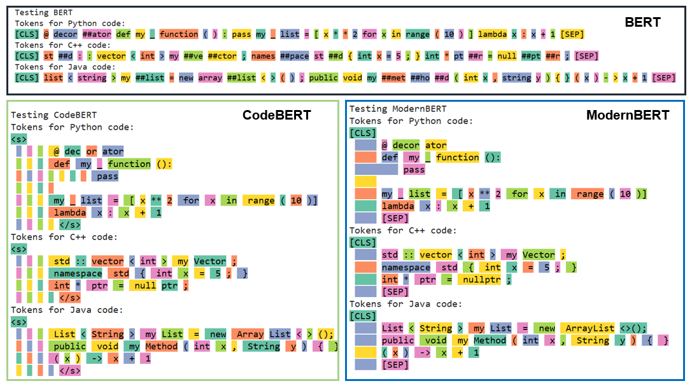
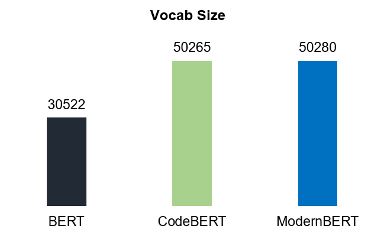
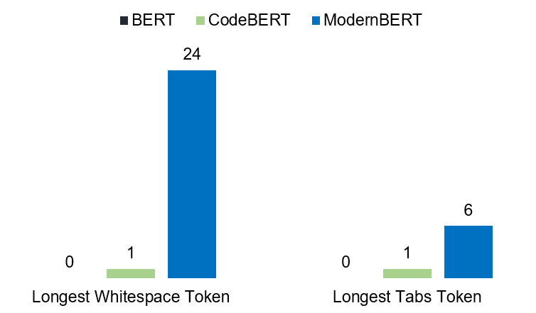
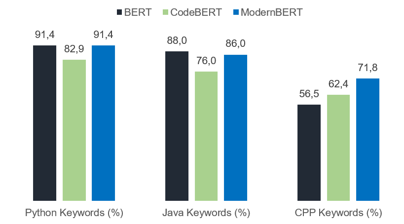
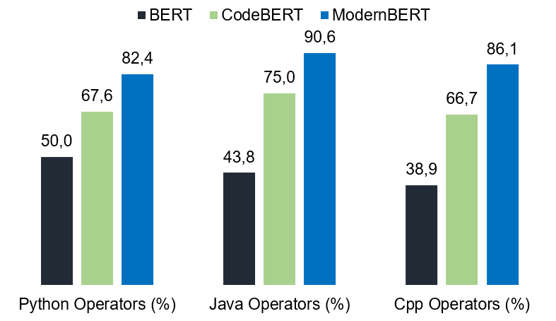

## Introduction  

[ModernBERT](https://arxiv.org/pdf/2412.13663)(2024) is the latest encoder-only model at the time of this repository's creation. The authors present it as a **Smarter, Better, Faster, and Longer** version of BERT, designed to improve performance across various NLP tasks.  

One of the key claims in the paper is that ModernBERT's tokenizer—built using an advanced BPE-based tokenization method—is inherently **"code-aware."** This claim stems from the fact that it was trained on a diverse mix of code and natural language data.  

The objective of this analysis is to rigorously evaluate ModernBERT's tokenizer in the context of **code tokenization** and compare its performance to that of [BERT](https://arxiv.org/pdf/1810.04805)(2018) and [CodeBERT](https://arxiv.org/pdf/2002.08155)(2020). Through various tests, this study aims to provide **quantifiable insights** into ModernBERT’s ability to handle programming constructs. Ultimately, this should help developers and researchers decide whether ModernBERT is the right choice for their applications, such as **retrieval-augmented generation (RAG)** and other **code-related tasks.**  

    

A visual comparaison between the tokenizers of BERT, CodeBERT and ModernBERT.

Before diving into the evaluations, it is true that BERT is an older model, but it remains widely used. While BERT was not trained on code and has a vocabulary size of **30K**, I include it here as a **baseline** for comparison.  

On the other hand, **CodeBERT** was trained on a large **code corpus** and has a vocabulary size similar to **ModernBERT** (**50K**). *[See Figure 1](#figure-1-model-vocabulary-sizes)*

    

 

Figure 1: Model Vocab Sizes

## Whitespace & Tabs  

### Whitespaces  
Whitespaces play a **critical role** in code formatting and readability. The goal of this study is to determine whether a tokenizer (**BERT, CodeBERT, and ModernBERT**) represents **different-length whitespace sequences as a single token or splits them into multiple tokens.**  

For example, does a sequence of **two spaces ("  ")** get tokenized as a single token, or does the tokenizer split it into two separate tokens? The same question applies to longer sequences of length **L**. *[See Figure 2](#figure-2)*  

    

 

Figure 2: Longest Whitespace/Tab Sequence With A Single Token

As expected, **BERT does not have a dedicated token for whitespace (" ").** This is because BERT uses the prefix **"##"** to indicate that a token is a **continuation** of the previous token. This mechanism allows BERT to implicitly track **spaces** between words without explicitly encoding whitespace tokens.  

For example, the word **"introduction"** might be tokenized as:  ['introdu', '##tion']. 
This means that the token **"##tion"** is **connected to the previous token** ("introdu") without an explicit space before it.  

CodeBERT, on the other hand, only has a single token for a single whitespace. This means that two spaces " " are split into two separate tokens. As a result, this tokenizer can be considered less code-aware in comparison to ModernBERT, especially when handling multiple consecutive whitespaces in code.

ModernBERT, however, takes a more efficient approach. It maps sequences of up to 24 consecutive whitespaces to a single token. This allows it to handle longer whitespace sequences more efficiently. For example, a whitespace sequence of length 10 is tokenized into a single token. This is a significant advantage because ModernBERT reduces the number of tokens required for long sequences of spaces, unlike CodeBERT, which would require L tokens for a whitespace sequence of length L.

### Indentation (Tabs)

When tokenizing a tab ("\t"), we get the following results:

| Tokenizer         | Tokenized Result |
|---------------|------------------|
| **BERT**      | []               |
| **CodeBERT**  | ['ĉ']            |
| **ModernBERT**| ['ĉ']            |

As observed, **BERT** completely ignores tabs, just like it does with whitespaces. In contrast, both **CodeBERT** and **ModernBERT** map the tab ("\t") to the same token `'ĉ'`, which is present in the vocabulary of both models. While it is unclear whether **CodeBERT** uses BPE for tokenization, the similarity to ModernBERT’s behavior suggests that it might, since ModernBERT uses BPE.

*[Figure 2](#figure-2)* illustrates the tab sequences that are mapped to a single token by the three tokenizers. Notably, the **CodeBERT** tokenizer splits any tab sequence longer than 1 (e.g., a sequence of three tabs `\t\t\t`) into separate tokens. On the other hand, **ModernBERT** can handle up to **6 consecutive tabs** as a single token.

This behavior makes **ModernBERT** highly efficient for code representation, especially in programming languages like **Python**, where indentation (tabs) plays a critical role in defining code structure.

### Tab-Space Merge

When tokenizing a sequence of mixed tabs and whitespaces, we find that **ModernBERT** is the only tokenizer that merges a whitespace and a tab (in this exact order) into a single token. Here are the results of tokenizing the sequence `"\t \t \t"`:

| Tokenizer         | Tokenized Result         |
|-------------------|--------------------------|
| **BERT**          | []                       |
| **CodeBERT**      | ['ĉ', 'Ġ', 'ĉ', 'Ġ', 'ĉ']|
| **ModernBERT**    | ['ĉ', 'Ġĉ', 'Ġĉ']        |

As seen in the table, **BERT** ignores the sequence entirely. **CodeBERT**, on the other hand, tokenizes each part of the sequence separately, treating each tab and space as distinct tokens. **ModernBERT**, however, merges a tab and space (in this exact order) into a single token, resulting in a more compact representation.

This behavior further demonstrates ModernBERT’s capability to better handle code sequences, providing more efficient tokenization when dealing with tab-space combinations, which are common in programming.

## Keywords & Operators

In this section, we analyze how the three tokenizers handle keywords and operators in three programming languages: Python, Java, and C++.

**Keywords** are reserved words in a programming language that have a predefined meaning and cannot be used as identifiers (e.g., variable names or function names). These are fundamental parts of the syntax in any language.

**Operators** are symbols used to perform operations on variables and values. For example, arithmetic operators like `+`, `-`, `*`, and `/` perform mathematical operations.

### Keywords (Python, Java, C++)

To have the most accurate sets of keywords for the three languages:

- **Python**: We will use the built-in list of Python keywords.
- **Java**: The official list (50 elements of Java SE8+): [Java Doc](https://docs.oracle.com/javase/specs/jls/se8/html/jls-3.html#jls-Keyword)
- **C++ (C++11 only)**: [C++ Doc](https://en.cppreference.com/w/cpp/keyword)

| Programming Language         | Tested Keywords |
|-----------------------------|-----------------|
| **Python**                  | 35              |
| **Java**                    | 50              |
| **C++**                     | 85              |

*N.B* The keywords and operators data are available in pickle files in this repo. Feel free to use them.

The measured KPI here is the share of keywords that are tokenized as a single token (i.e., not split).

[Figure 3](#figure-3) shows this KPI for the three tokenizers on the keywords of Python, Java, and C++.

An interesting insight here is that **BERT**, which was not trained on code, performs very well on the Python and Java sets. In fact, it performs better than **ModernBERT** on the Java set. However, this doesn't reveal much about the code abilities of BERT. This is because many keywords in Python and Java are common English words (e.g., `else`, `true`, `false`, `try`). This assumption is further supported by the fact that BERT struggles with C++ keywords, which tend to be more complex.

**CodeBERT** shows a medium but stable performance. Its results can be explained by the fact that it was trained on six different programming languages, which may have led to some loss of tokenization efficiency in favor of better generalization.

**ModernBERT**, on the other hand, consistently shows that it is well-aligned with programming languages.

    

Figure 3: Share of Keywords (Python, Java, C++) Tokenized as a Single Token.

To dig a bit deeper, let's tokenize the **'elif'** keyword, which is very Python-specific. We get the following results:

| Tokenizer         | Tokenized 'elif'        |
|-------------------|-------------------------|
| **BERT**          | ['eli', '##f']          |
| **CodeBERT**      | ['el', 'if']            |
| **ModernBERT**    | ['elif']                |

This proves that **BERT** still struggles with keywords that are not common English words. **CodeBERT** splits it into two tokens, while **ModernBERT** keeps it intact.

### Operators

#### Why Operators Matter
Operators are fundamental to how code functions, and how well they are tokenized impacts the efficiency and effectiveness of any model working with code. Tokenizing operators properly is crucial for:

- Maintaining the integrity of the code.
- Ensuring correct representation of syntax for downstream tasks like code completion, code summarization, or error detection.
- Improving efficiency in tokenization—if operators are tokenized as single tokens, it could reduce the overall number of tokens needed to represent a piece of code.

For operators, we will use the following documentation pages:

- **Python**: [Python Doc](https://docs.python.org/3/library/operator.html)
- **Java**: [Java Doc](https://docs.oracle.com/javase/tutorial/java/nutsandbolts/operators.html)
- **C++**: [Programiz Doc](https://www.programiz.com/cpp-programming/operators)

| Programming Language         | Tested Operators |
|-----------------------------|-----------------|
| **Python**                  | 34              |
| **Java**                    | 32              |
| **C++**                     | 36              |

    

Figure 4: Share of Operators (Python, Java, C++) Tokenized as a Single Token.

Unlike keywords, operators present a real challenge for **BERT**. Since it was not trained on a large code corpus, it struggles significantly with operators. **CodeBERT** and **ModernBERT** have decent performances, but **ModernBERT**'s tokenizer seems to be the best in handling operators.

## Test Data for Reproduction

Finally, here is the dataset containing all the test results. Feel free to reproduce the experiments, but don't forget to [cite this repository](https://github.com/kevlariii/ModernBERT-code-tokenizer-insights).

| Tokenizer     | Vocab Size | Longest Whitespace Token | Longest Tabs Token | Tab-Space Merging | Python Keywords (%) | Java Keywords (%) | C++ Keywords (%) | Python Operators (%) | Java Operators (%) | C++ Operators (%) |
|--------------|------------|--------------------------|---------------------|--------------------|----------------------|--------------------|------------------|----------------------|--------------------|------------------|
| **BERT**      | 30,522     | 0                        | 0                   | ❌                  | 91.4                 | 88.0               | 56.5             | 50.0                 | 43.8               | 38.9             |
| **CodeBERT**  | 50,265     | 1                        | 1                   | ❌                  | 82.9                 | 76.0               | 62.4             | 67.6                 | 75.0               | 66.7             |
| **ModernBERT**| 50,280     | 24                       | 6                   | ✅                  | 91.4                 | 86.0               | 71.8             | 82.4                 | 90.6               | 86.1             |

